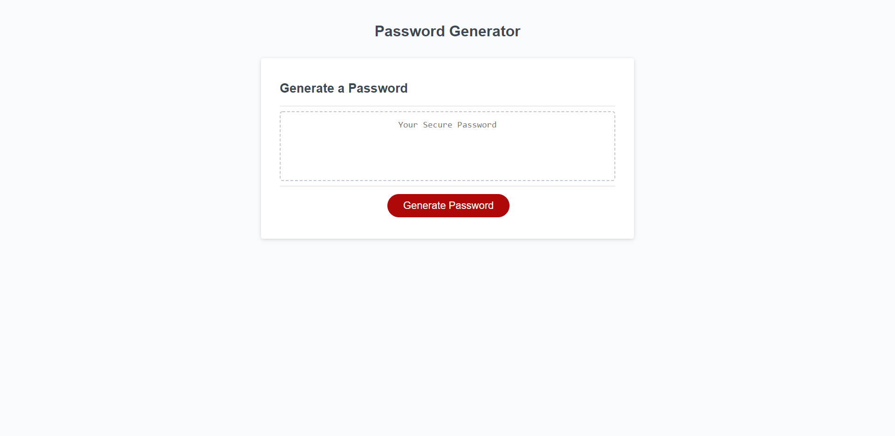

# Password Generator

This assignment required me to use javascript to allow a user to make a password based on selected variables of their choosing.

## Skills Practiced

- Declaring variables
- Use prompts to collect user input
- Use alerts to communicate back to user if input is unacceptable.
- Creating arrays to access based on what criteria is choosen.
- Push arrays into another array combing them to create a pool of characters to randomly select from.
- Writing if/else statements
- Create a loop that randomly selects characters from a built array
- Practiced proper syntax and code structure
- Use event.listener to cause one button to preform multiple functions

## Screenshot of Web Page

## Deployment URL

hhtps://peoplesm.github.io/password-generator/
